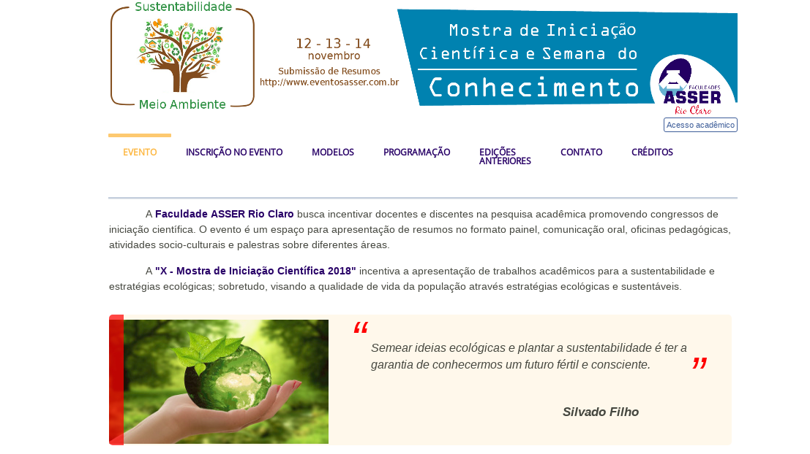

# Plataforma de EventosAsser

A submissão de trabalhos acadêmicos para eventos científicos exige um alto nível de formalismo, sobretudo com relação a organização, especificação e formatação de resumos. 

Nesse contexto, o uso de plataformas que melhorem o ciclo de submissão de resumos "submissão-revisão" pode promover a melhora da qualidade dos trabalhos submetidos bem como o processo de revisão. 

Contudo, ainda percebe-se uma carência por ferramentas e portais de submissão adequados ao contexto de alunos de graduação de graduação. Assim, a plataforma "EventosAsser" provê um conjunto de recursos para facilitar a submissão de trabalhos acadêmicos por alunos de graduação por meio de um conjunto de "perguntas-respostas". 

Atualmente, a plataforma "EventosAsser" é gratuita e é disponibilizada para download no GitHub.

  

**v4.0.1 (2018)**
   - Adicionado manuais para o portal
   - Modificada datas limites e proramação
   - Correções de link e texto

**v4.0.0 (2018)**
   - Versão estável em *PRD* para liberação em 17 de nov. de 2018
   - Modificada mensagem de abertura
   - Modificada listagem de professores como Orientador
   - Alterada datas de referência do cronograma
   - Adicionado cronograma de atividades de atividades (pagantes e/ou não pagantes) _desabilitado_
   - Adicionado geração de certificado por ano base (2018) _desabilitado_

**v3.0.0 (2017)**
   - Versão estável em *PRD* liberada em 13 de nov. de 2017 as 14:09
   - Correções emergênciais efetuadas até dia 09 de dez. 2017
   - Adicionado suporte para melhorar o controle de submissão dos Resumos
   - Geração automática de certificados para alunos pagantes no evento
   - Liberação do suporte ao uso de Perfis para o Aluno e Secretaria

**v2.0.0 (2016)**
   - Versão estável em *PRD* liberada em 11 de outubro de 2016
   - Melhorias de Backend
   - Modificação do Banco de Dados
   - Adição do conceito de Perfil (parcialmente) e gerenciamento de usuários por inscrição
   - Redução de detalhes do menu principal
   - Adicição de mensagens explicativas sobre o evento

**v1.0.0 (2016)**
   - Versão estável em *PRD* liberada em 06 de maio de 2016   
   - Inclui tratamento e melhorias de UI
   - Primeiro suporte a PDO e Sessions
